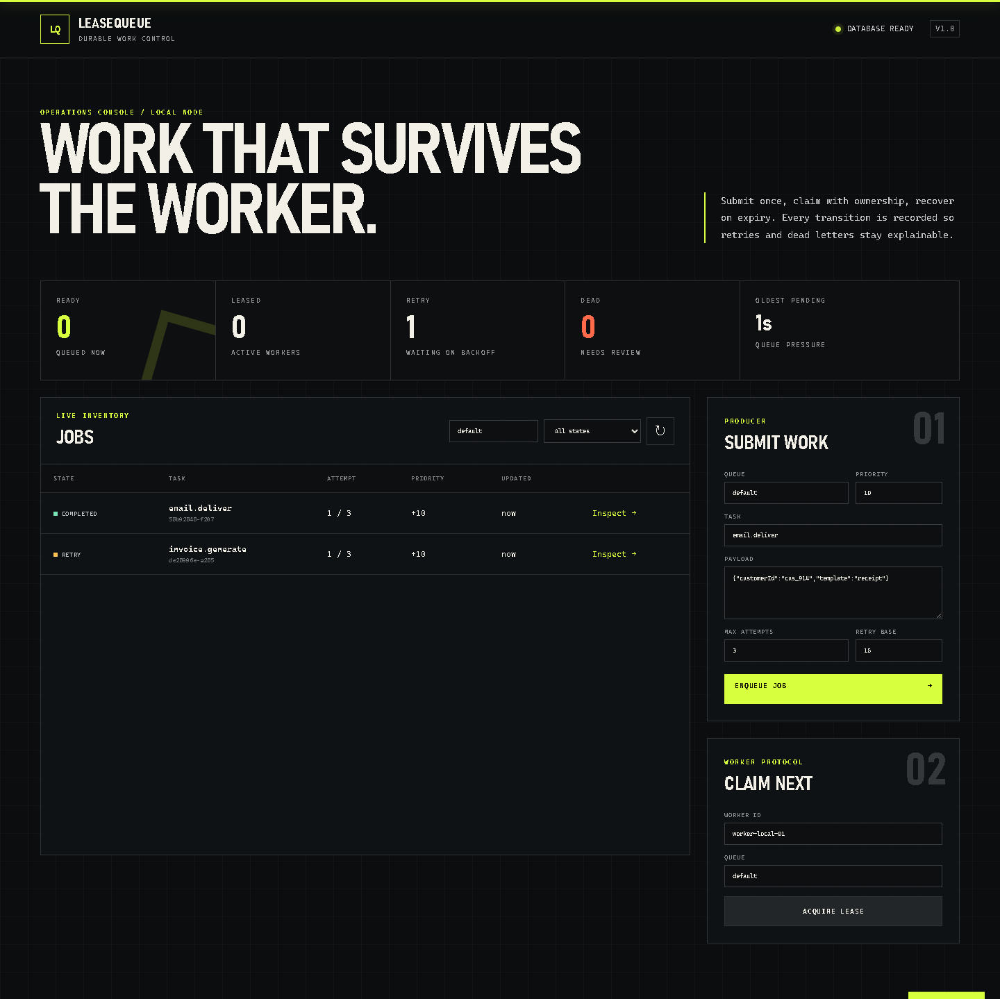
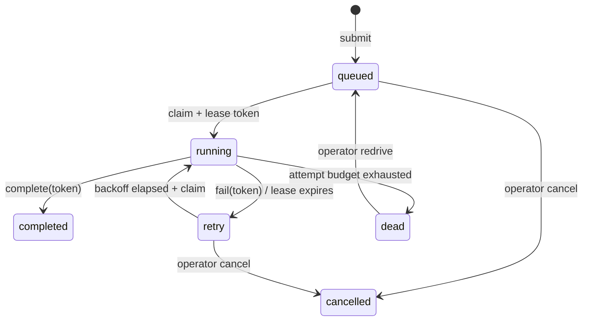

# LeaseQueue

[](https://github.com/kyan9400/leasequeue/actions/workflows/ci.yml)
[](https://github.com/kyan9400/leasequeue/releases/latest)
[](LICENSE)

A compact, durable background-job service with explicit lease ownership, bounded retries, idempotent submission, and dead-letter recovery. It runs as one FastAPI process with SQLite and includes an operations console, worker API, Prometheus metrics, and a hardened container.



## Live demo

[Open LeaseQueue](https://leasequeue.vercel.app/) — a public sandbox for exploring the queue and worker protocol. Its temporary database can reset when the Vercel container scales down; the Docker deployment below uses durable storage.

## Why it exists

In-memory background tasks disappear when a process restarts. A plain database status flag can let two workers run the same job or allow a late worker to overwrite a newer result. LeaseQueue makes those failure cases visible and testable without requiring a message broker.

- **Durable submission** — jobs and transition events commit to SQLite before the API responds.
- **Atomic claims** — `BEGIN IMMEDIATE` serializes the select-and-lease transition across workers.
- **Explicit ownership** — completion, failure, and heartbeat calls require the current opaque lease token.
- **Crash recovery** — the next claim recovers an expired lease and preserves the attempt budget.
- **Safe retries** — failures use bounded exponential backoff and exhausted jobs enter a dead-letter state.
- **Idempotent producers** — queue-scoped keys return the original job and reject changed request bodies.
- **Operational evidence** — every state transition has a timestamped event; metrics expose queue pressure.

## State model



A lease token is returned only by the claim response. Read endpoints expose the worker and expiry time, but never the token or stored idempotency key.

## Quick start

Requires Python 3.12 or newer.

```bash
python -m venv .venv
python -m pip install -e .
leasequeue --host 127.0.0.1 --port 8000
```

Open `http://127.0.0.1:8000`. Interactive API documentation is available at `/docs` outside production mode.

Or run the hardened container:

```bash
docker compose up --build
```

The Compose service uses a named data volume, a read-only root filesystem, no Linux capabilities, a non-root user, and a readiness health check.

## Worker protocol

Submit a job with a producer-owned idempotency key:

```bash
curl --request POST http://127.0.0.1:8000/api/jobs \
  --header 'Content-Type: application/json' \
  --header 'Idempotency-Key: invoice-inv_481-v1' \
  --data '{
    "queue": "billing",
    "task": "invoice.generate",
    "payload": {"invoiceId": "inv_481", "format": "pdf"},
    "priority": 10,
    "maxAttempts": 3,
    "retryBaseSeconds": 15
  }'
```

Claim the highest-priority eligible job:

```bash
curl --request POST http://127.0.0.1:8000/api/jobs/claim \
  --header 'Content-Type: application/json' \
  --data '{"queue":"billing","workerId":"worker-01","leaseSeconds":60}'
```

The response contains `job` and `leaseToken`. A worker should heartbeat before the lease expires, then complete or fail using that same token:

```bash
curl --request POST http://127.0.0.1:8000/api/jobs/JOB_ID/complete \
  --header 'Content-Type: application/json' \
  --data '{"leaseToken":"TOKEN_FROM_CLAIM"}'
```

If a worker can perform an external side effect, that side effect should also be idempotent. Lease ownership prevents stale acknowledgements; it cannot undo work performed outside LeaseQueue.

## API surface

| Method | Path | Purpose |
| --- | --- | --- |
| `POST` | `/api/jobs` | Submit or deduplicate a job |
| `GET` | `/api/jobs` | Filter recent jobs by queue and state |
| `GET` | `/api/jobs/{id}/events` | Read the transition timeline |
| `POST` | `/api/jobs/claim` | Atomically acquire the next eligible job |
| `POST` | `/api/jobs/{id}/heartbeat` | Extend an active lease |
| `POST` | `/api/jobs/{id}/complete` | Complete with the matching lease token |
| `POST` | `/api/jobs/{id}/fail` | Schedule a retry or dead-letter the job |
| `POST` | `/api/jobs/{id}/redrive` | Reset a dead-lettered job for another run |
| `POST` | `/api/jobs/{id}/cancel` | Cancel a queued or retrying job |
| `GET` | `/api/stats` | Read dashboard counts and queue age |
| `GET` | `/metrics` | Scrape Prometheus text metrics |
| `GET` | `/health/live`, `/health/ready` | Process and database health |

All request models reject unknown fields. Job payloads are capped at 64 KiB, request bodies at 128 KiB by default, names and worker identifiers are bounded, and active lease tokens are compared in constant time.

## Configuration

| Environment variable | Default | Meaning |
| --- | --- | --- |
| `LEASEQUEUE_DATABASE_PATH` | `leasequeue.db` | SQLite database file |
| `LEASEQUEUE_ENVIRONMENT` | `development` | Set to `production` to disable API docs |
| `LEASEQUEUE_MAX_REQUEST_BYTES` | `131072` | Content-length guard for request bodies |

[`.env.example`](.env.example) lists these variables with their defaults. LeaseQueue reads the process environment only, so export the values in your shell or pass a copy of the file with `docker run --env-file .env`.

SQLite WAL mode and a five-second busy timeout are enabled on each connection. Claim operations deliberately serialize writers; this project targets a compact single-node workload, not broker-scale throughput or multi-region replication.

## Verification

```bash
python -m pip install -e ".[dev]"
ruff check .
ruff format --check .
pytest
python -m build
```

CI runs linting, package builds, and the transition suite on Python 3.12 and 3.13 across Linux and Windows. A separate job builds the non-root image, scans for high and critical vulnerabilities, verifies the runtime user, and smoke-tests the dashboard and API.

## Operations

See [the operations guide](docs/operations.md) for backup, restore, lease recovery, upgrade, and rollback procedures. Before upgrading, stop writers and preserve the SQLite data volume. Deploy immutable version tags and verify `/health/ready`, `/api/stats`, and a claim/complete cycle.

## Security boundary

LeaseQueue intentionally has no end-user authentication. Run it on a private network or behind an authenticated reverse proxy, protect the data volume, and restrict the worker mutation endpoints. See [SECURITY.md](SECURITY.md) for the reporting process and deployment guidance.

## License

[MIT](LICENSE)
